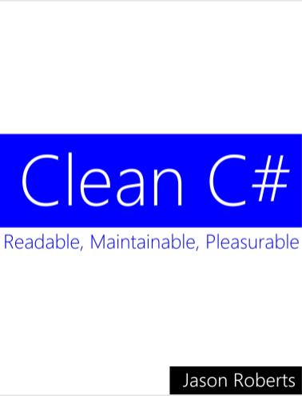
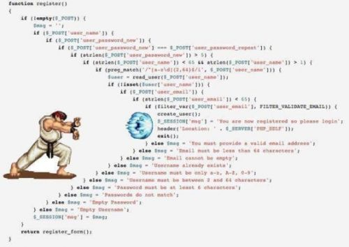

[TOC]


# 前言

《Clean C#》的副标题是**Readable,Maintainable,Pleasurable**，本书旨在提供一些编写具有良好可读性与可维护性代码的建议。虽然书名中带有C#字眼，但书中提供的经验绝不仅限于C#，也可用于其他语言。

书中内容涉及到：命名方式、异常处理、代码基本设计原则、单元测试及代码排版等多个方面内容。

该译文不是对原著进行一字一句的翻译，而是根据自己的理解，对原著的语言进行了重新编排以便更符合汉语表述习惯。此外，还对书中内容进行了一定程度的修订（增、删及内容顺序的调整），如，在每个章节的结尾会加入一段总结，文末也可能会添加一些扩展阅读文章链接。

书中的示例代码，如果命名空间名称以Dirty结尾，表示是这段代码是待优化代码；而命名空间名称以Clean结尾，则表示这段代码已按照书中的观点进行优化。

```c#
namespace CleanCSharp.Errors.Dirty
{
    // 待优化
}

namespace CleanCSharp.Errors.Clean
{
    // 已优化
}
```

由于本人水平有限，译文中难免有错误之处，望各位多多指教。

本书的翻译未经作者授权，仅作学习用途，转载务必保留原书及作者信息。原书封面及作者信息如下：




---

雪飞鸿 · 写于2018-10-22


# 注释

简洁明了的注释有利于代码的阅读和理解，但不必要的注释则会增加代码的维护难度。

## 五种应该避免的注释

下面列举了几种不好的注释习惯，并且给出了改进建议：

#### 1. 注释重复描述代码已清晰表述的意思

```c#
namespace CleanCSharp.Comments.Dirty
{
    // This defines a class called BasicCalculator 
    public class Calculator
    {
        // Define default constructor 
        public Calculator() { }

        // Define a method to add two numbers 
        public int AddTwoNumbers(int a, int b)
        {
            // declare an int to hold result int result;
            // set result to sum of a and b 
            result = a + b;

            // return the result to the caller 
            return result;
        }
    }
}

```

上段代码中，明显注释过多，且用于描述代码已经表述清楚的内容。这样做，不仅对阅读代码没有帮助，还会显得代码臃肿。

注意以下注释：

```c#
 // This defines a class called BasicCalculator 
public class Calculator
```

这句注释没有什么意义，并且注释中还把类名写错。**注释应当与代码同步更新**，代码中的无用注释会在这方面耗费开发人员过多的精力。

对上述代码进行精简，如下：

```c#
namespace CleanCSharp.Comments.Dirty
{
    public class Calculator
    {
        public int AddTwoNumbers(int a, int b)
        {
            result = a + b;

            return result;
        }
    }
}
```

去除了无用注释及默认无参构造函数后，代码结构更加清晰且更具可读性。

#### 2. 版本控制中的注释

```c#
namespace CleanCSharp.Comments.Dirty
{
    /* 10 Oct 2010 Sarah Smith - Created initial version 
    * Edited 20 Oct 2010 Amrit P - change calculation method 
    * Edited 20 Nov 2010 Jane Q - fix defect 4286 
    */
    public class MyClass { }
}
```

上述代码中的注释，主要描述了何时，以及为什么对文件做了修改。

如果代码已被添加到版本控制系统中，那么这些注释就没有必要存在。如果还没有使用版本控制系统，那么，建议你使用版本控制系统对源代码进行管理。

#### 3. 使用多余的注释而非自描述的命名

```c#
namespace CleanCSharp.Comments.Dirty
{
    public class SimpleCalculator
    {
        // Add two numbers together 
        public int Calculate(int a, int b)
        {
            return a + b;
        }
    }
}
```

这里的注释可以用良好的方法命名来替代：

```c#
namespace CleanCSharp.Comments.Dirty
{
    public class SimpleCalculator
    {
        public int AddNumbers(int a, int b)
        {
            return a + b;
        }
    }
}
```

良好的命名不需要额外的注释来解释，**尽可能使用良好的命名来替代注释**，而不是用注释解释难以理解的命名。

#### 4. 注释掉的代码

有时，我们会在代码库中看到已被注释掉的代码，如下所示：

```c#
namespace CleanCSharp.Comments.Dirty
{
    public class AnotherSimpleCalculator
    {
        public int AddNumbers(int a, int b)
        {
            // a = a + 42;
            return a + b;
        }
    }
}
```

上述代码中的注释`// a = a + 42;`会让人疑惑，我们即不清楚这段代码的作用，也不明白它为什么会被注释掉。像这种让读者疑惑的注释降低了代码的可读性。

对于无用（或感觉将来可能有用）或开发中临时添加的代码，不应被直接注释掉，而应尽可能删除，如果需要，我们可以在版本控制系统中查看。

如需保留被注释掉的代码，也应说明注释调的原因及在何种情况下可以恢复。

#### 5. 无意义的XML注释

```c#
namespace CleanCSharp.Comments.Dirty
{
    /// <summary> 
    /// 
    /// </summary> 
    public class BasicCalculator
    {
        /// <summary> 
        /// Adds two numbers 
        /// </summary> 
        /// <param name="a"></param> 
        /// <param name="b"></param> 
        /// <returns></returns> 
        public int AddNumbers(int a, int b)
        {
            return a + b;
        }
    }
}
```

虽然IDE会因为我们没有给某个方法或类添加XML注释而生成警告，但我们不应因此而增加无意义的XML注释。

上述代码有近乎一半的篇幅被无意义的XML文档所占据，这会对代码的阅读造成视觉干扰，降低代码阅读效率。下面是去掉XML注释后的代码，简介而又有着良好的可读性。

```c#
namespace CleanCSharp.Comments.Dirty
{
    public class BasicCalculator
    {
        public int AddNumbers(int a, int b)
        {
            return a + b;
        }
    }
}
```

通常暴露给第三方调用的API，需要添加较为完备的XML文档注释，以辅助调用方理解API，此时对于XML文档的冗余问题则另当别论。

## 小结

综上，总结写注释的几点小建议：

1. 在编码时尽可能使用良好的命名以达到代码的自描述，这样可以少写注释且可避免注释的词不达意；
2. 若非必要，勿添加注释，注释的维护工作也是相当耗费精力的；
3. 程序中尽可能不要遗留被注释掉的代码，以免给后来者造成困惑；

一句话：**注释是为提升代码可读性和可维护性而存在，若你的注释达不到这个目的，则应考虑是否还有保留注释的必要性**。

## 推荐阅读

[Redis是如何写代码注释的？](https://mp.weixin.qq.com/s/vH1QU4JC2D3dUI_OtKQjpw)


# 命名

代码中类、方法、变量及其它成员的命名对于理解和维护系统有着巨大影响。好的命名应是自描述，命名时偷懒、随意，对于后续的维护工作会造成不小的麻烦。

## 什么是好的命名

好的命名应具备以下几点：

1. 具有一定意义（Expressive ）

2. 语义准确（Accurate ）

3. 长度合适（Suitable length ）

4. 可读（ Pronounceable）

   变量名应可以让大家可以读的出，不要用生僻单词或不合适的简写

#### 1. 具有一定意义 & 语义准确

命名应当可以描述自己意图且不存在歧义（有点儿难:gem:），下面这段代码中，第三个变量名更具自描述性。在注释一章中讲过，良好的命名可以替代注释，显然第一个变量名效果最差：

```c#
var n = "Jason"; // default name of new user 
var name = "Jason";
var defaultNewUserName = "Jason";
```

下面是一个更差劲的命名示例，名称为Add的方法内部却执行了乘法运算，语义上有着严重的误导：

```c#
public int Add(int a, int b)
{
    return a * b;
}
```

#### 2. 长度合适

对比下面两段代码，第一段代码方法及参数名过长，且类名有着不恰当的简写形式，不符合命名语义清晰的原则。使用者为了弄清楚Cal类的含义，需要转到Cal类的定义阅读，导致过多的陷入细节，这对于弄懂整个系统流程是不利的。

```c#
namespace CleanCSharp.Naming.SuitableLength.Dirty
{
    public class Cal
    {
        public int AddTwoNumbersTogetherAndReturnTheResult(int theFirstNumberToAdd, int theSecondNumberToAdd)
        {
            return theFirstNumberToAdd + theSecondNumberToAdd;
        }
    }
}
```

若类命名良好，可以辅助理解类中方法中的功能；同理，良好的方法命名则有助于理解方法参数的含义。

我们可以感受到第二段代码更易阅读，因为类和方法命名语义清晰，所以方法参数使用a和b的形式也是可以的。

```c#
namespace CleanCSharp.Naming.SuitableLength.Clean
{
    public class Calculator
    {
        public int Add(int a, int b)
        {
            return a + b;
        }
    }
}
```

但若，参数有着特定的语义，则不应使用a和b这种形式：


```c#
namespace CleanCSharp.Naming.SuitableLength.Clean
{
    public class Calculator
    {
        public int Add(int firstNumber, int secondNumber)
        {
            return firstNumber + secondNumber;
        }
    }
}
```

通常较长的命名更具自描述性，但若命名过长则会增加阅读代码时大脑的负担，特别是遇上代码因过长而换行时的情况。我们应根据实际场景来权衡成员名称的长度。

#### 3. 可读

对比下面两段代码，明显第二段中方法参数更具可读性。在团队中交流时，我们可以说出`firstName`，但`fstName`该怎么读呢？

```c#
namespace CleanCSharp.Naming.Pronounceable.Dirty
{
    public class NewUsrValidtr
    {
        public bool ValidateNme(string fstNme, string lstNme)
        {
            return true; // for demo code purposes 
        }
    }
}
```

```c#
namespace CleanCSharp.Naming.Pronounceable.Clean
{
    public class NewUserValidator
    {
        public bool ValidateName(string firstName, string lastName)
        {
            return true; // for demo code purposes 
        }
    }
}
```

## 成员命名

#### 两种命名风格

+ Pascal Casing :帕斯卡命名法，所有单词首字母均大写：PascalCasing

+ Camel Casing :驼峰命名法，首字母小写，其余单词首字母大写开头：camelCasing


也经常会用到一些约定成俗的缩写，如：IO,HTML,DAO,DTO...

#### 命名空间

命名空间采用帕斯卡命名方式，能够描述其内部包含了哪些内容，可以避免内部类与不同库中同名类冲突。

建议采用如下方式：`[CompanyName].[ProductOrTechnology].[Feature].[Subnamespace]`

不建议在命名空间名称中使用版本号；

不建议使用过于大众化的命名方式，如Helpers或Utilities。可以使用HtmlHelpers或StringUtilities这种能够描述其内部会包含哪些内容的名称；

不建议命名空间名称和其内部类型重名；

#### 接口

接口命名使用帕斯卡方式，且以大写字母**I**开头。

接口名称尽可能采用形容词、名词或形容词短语、名词短语。如下两个C#中常常搭配使用的一对接口，也是接口命名的典范：

```c#
namespace System.Collections
{
    public interface IEnumerable
    {
        IEnumerator GetEnumerator();
    }

    public interface IEnumerator
    {
        object Current { get; }

        bool MoveNext();

        void Reset();
    }
}
```

#### 类 & 特性 & 异常

类命名使用帕斯卡命名方式，并且尽可能使用名词或名词短语。

如果类是接口的唯一实现类，称为`class-interface pair`。此种情况建议类名应和接口名一致（接口名去除首字母I后即为类名）：

```c#
namespace Microsoft.AspNetCore.Hosting
{
    /// <summary>
    /// A builder for IWebHost
    /// </summary>
    public class WebHostBuilder : IWebHostBuilder
    {
    }
}
```

对于派生类，可以使用基类作为自己的后缀以追求语义上的一致性。如，异常与特性：

```c#
namespace System
{
    public class SystemException : Exception
    {
    }
}
```
```c#
namespace System.Web.Http.Filters
{
    public abstract class ActionFilterAttribute : FilterAttribute
    {
    }
}
```


#### 方法 & 参数 & 局部变量

方法命名使用帕斯卡方式，且尽可能使用动词或动词短语以表示要执行某种操作。

```c#
public void Customer(){}

public void SaveCustomer(){}
```

以上代码，第二个方法命较第一个在语义上更有意义，我们看到第二个方法命就可以知道起作用。若使用第一个方法命则需要使用额外的注释来说明其功能，否则会对使用者或阅读代码的人造成困惑。

方法参数使用驼峰命名法，尽可能使用语义明确的名称，在不影响可读性的前提下，可适当简写。参考 【好的命名-2.长度合适】

局部变量使用驼峰命名法，对于循环中的变量，可以使用`i或j`这种简写方式：

```c#
foreach(var i in list)
{
    // ...
}
```

#### 属性

属性命名使用帕斯卡方式，且尽可能采用形容词、名词或名词短语。

对于表示集合的属性则可为属性名添加`List或Collection`作为后缀。

```c#
public class Order
{
    public string OrderId { set; get; }
    
    public IList<Product> ProductList { set; get; }
}

public class Product
{

}
```

#### 事件

事件命名使用帕斯卡方式，且尽可能采用动词或动词短语。

如果事件描述了一组有先后顺序，可以考虑使用Closing、Closed的形式替代BeforeClose、AfterClose的形式。

事件处理器中的参数有几个常用的固定写法，如，`sender`和`e`：

```c#
namespace System
{
    public delegate void EventHandler(object sender, EventArgs e);
}
```

#### 字段

对于非私有字段(Public/Protected)，使用帕斯卡命名方式，且尽可能使用名词、名词、形容词。

对于私有字段(Private)则使用驼峰命名法，且以下划线开头。

```c#
public string PublicField;

protected string ProtectedField;

private string _privateField
```

以下是我个人使用的其它形式字段命名规范（与访问修饰符无关）：

```c#
const string CONST_FIELD = "const field";

static string StaticField = "static field";

readonly string ReadOnlyField = "readOnlyField"
```

#### 布尔类型

对于布尔类型的变量，应该能够在语义上表述出True/False或Yes/No的意思，通常布尔类型变量以is(JAVA中貌似推荐不用is开头)、has开头。

对比下面两端代码，第二段在语义上更清晰：

```c#
namespace CleanCSharp.Naming.Booleans.Dirty
{
    class BooleanRelatedNames
    {
        public void SomeMethodWithBooleanVariables()
        {
            bool close = false;
            if (close)
            {
                // etc. 
            }
            bool user = false;
            if (user)
            {
                // 
            }
        }
        
        public bool Open { get; set; }
        
        public bool Value() { return false; }
    }
}
```

注意，这里的变量`loggedIn`并未使用is或has开头，因为它在语义上已足够清晰。

```c#
namespace CleanCSharp.Naming.Booleans.Clean
{
    class BooleanRelatedNames
    {
        public void SomeMethodWithBooleanVariables()
        {
            bool isClosed = false;
            if (isClosed)
            {
                // etc. 
            }
            bool loggedIn = false;
            if (loggedIn)
            {
                // 
            }
        }
        
        public bool IsOpen { get; set; }
        
        public bool HasValue() { return false; }
    }
}
```

#### 泛型形参

泛型形参通常以大写字母T开头。

对于只有一个形参的泛型,可直接使用T表示形参；对于多个形参的泛型类型，则形参名称以T开头使用帕斯卡风格，且应保证语义清晰：

```c#
public interface IList<T>
{
}

public interface IDictionary<TKey, TValue> 
{
}
```

#### 枚举

枚举命名使用帕斯卡方式。枚举名称尽可能使用单数形式表示，除非是标志枚举，因为标志枚举通常表示一个组合。也无需使用`Enum或Flags`作为枚举后缀。

其实，我一直倾向于使用Enum作为枚举名称的后缀:smiley:。

## 一些通用规则

+ 命名应尽可能简洁

+ 命名不应在语义上给读者造成困惑

+ 不应使用相似的名称表述不同的语义，编码时稍不仔细就可能因此埋雷（表示自己遇到过:shit: ）


+ 不要通过大小写形式的不同来区分不同的变量名（VB.NET本身就不区分大小写），原因同上


+ 不要使用不同的名称来表述同一概念

## 小结

良好和统一的命名风格，对于系统的维护是有莫大好处的。作为C#程序员可以以.NET基础类库中的命名规范作为自己项目命名规范的参考，毕竟.NET类库相当庞大而且存在了十多年，其规范是很有参考价值的。

以上规则具有一定的通用性，但不同语言间有着自己约定的一套命名规范。如：C#中方法命名使用帕斯卡方式，JAVA则用驼峰命名法，Python则使用下划线来分割不同单词：

```c
public void CSharpMethod(){}

public void javaMethod(){}

def python_func():
    pass
```

最后想说一点，我们应该优先遵循团队内部的规定，其次是语言本身的约定，再然后才是一些通用规则。

## 推荐阅读

[Visual Studio 代码风格约束](https://www.jianshu.com/p/b479db7255c6)

[Python命名规范](https://zh-google-styleguide.readthedocs.io/en/latest/google-python-styleguide/python_style_rules/#id16)

[Naming Guidelines](https://docs.microsoft.com/en-us/dotnet/standard/design-guidelines/naming-guidelines)


# 方法

方法是系统的基本组成部分，编写优雅的方法是良好的开端。

## 方法行数和清晰度

通常，行数越少，方法越清晰，可读性越高。当方法具有以下特征时，可以考虑重构：

+ 嵌套太多

  

+ 处理过多的逻辑，特别是不同的业务逻辑（不符合单一职责）

+ 阅读时需要滚动屏幕

+ Work being performed at multiple abstraction levels

+ 方法被多个抽象级别调用

下面是一组根据代码行数评判方法优劣的参考标准：

+ 少于11行：优
+ 11行至20行：良
+ 21行至50行：中
+ 超过50行：差

> :warning: 但代码行数不是评判方法优劣的唯一标准。命名、参数的多少、是否符合单一职责、是否利于单元测试等也应考虑在内。
>
> 我们不能为了减少代码行数而丧失方法的可读性，而是在保证可读性的前提下尽可能减少代码行数

## 高内聚

如果一个方法不符合单一职责，如处理过多的逻辑或不同类型的任务，它就很难保证一个较少的行数且不具有高内聚性。

对比下面两段代码，第一段中Process方法中处理了过多的逻辑细节，第二段代码对其进行重构后Process方法在结构和语义上变得更加清晰，并且提取出的两个方法`IsValidCustomer`和`SaveCustomer`可以在其它地方复用。

```c#
namespace CleanCSharp.Methods.Dirty
{
    class Utils
    {
        public int Process(Customer customer)
        {
            if (string.IsNullOrWhiteSpace(customer.FirstName) || string.IsNullOrWhiteSpace(customer.LastName))
            {
                return -1;
            }
            else
            {
                var service = new CustomerService();
                if (!service.Save(customer))
                {
                    return -1;
                }
                else
                {
                    return 1;
                }
            }
        }
    }
    
}
```

上面的代码中还出现了如1和-1这样的硬编码（魔法字符串），阅读者不知道他们代表什么含义，这种硬编码不应该出现。虽然上述代码行数不多，但它并不是一个好方法。

```c#
namespace CleanCSharp.Methods.Clean
{
    class Utils
    {
        public int Process(Customer customer)
        {
            const int customerNotSaved = -1; 
            const int customerSavedSuccessfully = 1;
            if (!IsValidCustomer(customer))
            {
                return customerNotSaved;
            }
            if (!SaveCustomer(customer))
            {
                return customerNotSaved;
            }
            return customerSavedSuccessfully;
        }
        
        private bool IsValidCustomer(Customer customer)
        {
            if (string.IsNullOrWhiteSpace(customer.FirstName) || string.IsNullOrWhiteSpace(customer.LastName))
            {
                return false;
            }
            return true;
        }
        
        private bool SaveCustomer(Customer customer)
        {
            var service = new CustomerService();
            var successfullySaved = service.Save(customer);
            return successfullySaved;
        }
    }
    
}
```

方法应该符合单一职责原则，这样方法会具备高内聚、利于单元测试、利于复用、较少行数、易于阅读和维护等优点。

## 抽象层级（Abstraction Levels）

按作者书中描述，抽象层级类似于我们平日所说高层模块、底层模块的概念。即，高层模块抽象层级高，底层模块抽象层级低。

作者在书中所要表述的意思可以归纳为一句话：**越高高层级的抽象层越不要暴露过多的细节**。

我们在阅读高抽象层级的代码时，应该像阅读业务流程说明书一样，不应在细节上耗费太多精力与时间。当我们需要了解细节时，在转到相关方法的定义去查看即可。如：

HTTP是应用层的一种网络通讯协议。这句话就是高层级的抽象层，至于HTTP的细节则属于底层级的抽象层。

仔细体会下下面重构前后两段代码的差异。重构前：

```c#
public class ProspectiveCustomerValidator
{
    public Customer CreateValidatedCustomer(ProspectiveCustomer prospectiveCustomer)
    {
        if (string.IsNullOrWhiteSpace(prospectiveCustomer.FirstName))
        {
            throw new ArgumentException("Invalid FirstName");
        }
        if (string.IsNullOrWhiteSpace(prospectiveCustomer.SecondName))
        {
            throw new ArgumentException("Invalid SecondName");
        }
        var newValidCustomer = new Customer
        {
            FirstName = prospectiveCustomer.FirstName,
            SecondName = prospectiveCustomer.SecondName
        };
        if (prospectiveCustomer.AnnualIncome > 100000)
        {
            newValidCustomer.IsPriorityCustomer = true;
        }
        return newValidCustomer;
    }
}
```

重构之后：

```c#
public class ProspectiveCustomerValidator
{
    // Higher abstraction level
    public Customer CreateValidatedCustomer(ProspectiveCustomer prospectiveCustomer)
    {
        EnsureValidDetails(prospectiveCustomer);
        var validatedCustomer = CreateNewCustomerFrom(prospectiveCustomer);
        SetCustomerPriority(validatedCustomer);
        return validatedCustomer;
    }
    
    // Medium abstraction level
    private static void EnsureValidDetails(ProspectiveCustomer prospectiveCustomer)
    {
        EnsureValidFirstName(prospectiveCustomer);
        EnsureValidSecondName(prospectiveCustomer);
    }
    
    private static Customer CreateNewCustomerFrom(ProspectiveCustomer prospectiveCustomer)
    {
        return new Customer { FirstName = prospectiveCustomer.FirstName, SecondName = prospectiveCustomer.SecondName, AnnualIncome = prospectiveCustomer.AnnualIncome };
    }
    
    // Low abstraction level
    private static void EnsureValidFirstName(ProspectiveCustomer prospectiveCustomer)
    {
        if (string.IsNullOrWhiteSpace(prospectiveCustomer.FirstName))
        {
            throw new ArgumentException("Invalid FirstName");
        }
    }
    
    private static void EnsureValidSecondName(ProspectiveCustomer prospectiveCustomer)
    {
        if (string.IsNullOrWhiteSpace(prospectiveCustomer.SecondName))
        {
            throw new ArgumentException("Invalid SecondName");
        }
    }
    
    private static void SetCustomerPriority(Customer customer)
    {
        if (customer.AnnualIncome > 100000)
        {
            customer.IsPriorityCustomer = true;
        }
    }
}
```

## 执行动作或给出答复

可以使用下面两个标准判断一个方法是否高内聚：

+ 是否执行了某些动作或实现了某些功能，或
+ 是否回答了调用者的问题；

如果一个方法同时具备上述两点，那么可以考虑对方法进行重构。

如方法`IsValidCustomer`就只是回答了调用方客户信息是否合法的问题：

```c#
private bool IsValidCustomer(Customer customer)
{
    if (string.IsNullOrWhiteSpace(customer.FirstName) || string.IsNullOrWhiteSpace(customer.LastName))
    {
        return false;
    }
    return true;
}
```

而方法`SaveCustomer`即执行了保存客户信息的操作，同时也告诉了调用方保存是否成功。

```c#
private bool SaveCustomer(Customer customer)
{
    var service = new CustomerService();
    var successfullySaved = service.Save(customer);
    return successfullySaved;
}
```

我们可以基于异常来对该方法进行重构：

```c#
private void SaveCustomer(Customer customer)
{
    var service = new CustomerService();
    try
    {
        service.Save(customer);
    }
    catch (Exception ex)
    {
        // 处理异常或抛给调用方
    }
}
```

这里好怀念JAVA中的throws关键字，可以让调用方明确感受到被调用的方法可能抛出哪些异常。

即执行某些操作又返回操作是否成功的形式，在ORM框架中使用比较多，它们通常返回一个整数类型表示本次方法调用数据库受影响行数。如EF中的SaveChanges、Dapper中的Execute等：

```c#
public virtual int SaveChanges()
{
    // ...
}

public static int Execute(this IDbConnection cnn, CommandDefinition command)
{
    // ...
}
```

其实，.NET基础类库中的TryParse方法也是这种形式：

```c#
public static bool TryParse(string s, out int result)
{
    // ...
}
```

个人感觉，即执行动作又返回结果这种形式可以接受。

## 方法参数

方法参数越多，越难以理解，也越难以维护。下面是一组根据代码行数评判方法优劣的参考标准：

+ 无参：优
+ 一个参数：良
+ 两个参数：中
+ 三个参数：较差
+ 多于三个参数：差

这只是一个参考标准，如【方法行数和清晰度】所述，方法优劣的评判不能只看一方面。

可以将方法中的多个参数封装成一个类以减少参数个数。

#### 根据布尔类型切换业务逻辑

对于方法接受布尔类型参数来执行不同业务逻辑的情况，建议对方法进行拆分。下面的例子中将方法`OutputGreeting`拆分为`OutputDaytimeGreeting`和`OutputMorningGreeting`：

```c#
namespace CleanCSharp.Methods.Dirty
{
    class BooleanSwitchingArgumentsExample
    {
        public void CallingCode()
        {
            if (DateTime.Now.Hour < 12)
            {
                OutputGreeting(true);
            }
            else
            {
                OutputGreeting(false);
            }
        }
        
        public void OutputGreeting(bool isMorning)
        {
            if (isMorning)
            {
                Console.WriteLine("Good Morning");
            }
            else
            {
                Console.WriteLine("Good Day");
            }
        }
        
    }
}
```

```c#
namespace CleanCSharp.Methods.Clean
{
    class BooleanSwitchingArgumentsExample
    {
        public void CallingCode()
        {
            if (DateTime.Now.Hour < 12)
            {
                OutputMorningGreeting();
            }
            else
            {
                OutputDaytimeGreeting();
            }
        }
        
        private static void OutputDaytimeGreeting()
        {
            Console.WriteLine("Good Day");
        }
        
        private static void OutputMorningGreeting()
        {
            Console.WriteLine("Good Morning");
        }
        
    }
}
```

`DateTime.Now.Hour < 12`这个判断条件与模板方法中的钩子函数作用相似。

#### 不同方法中具有相同逻辑

如若不同方法中含有相同的逻辑，应把相同的逻辑提取出来封装为一个公共方法。

## 小结

方法优劣的评判标准不是唯一的，但应符合**单一职责**原则，这样方法自然就是高内聚的，且利于单元测试、利于复用、易于阅读和维护。

方法行数不要太多，这不仅利于方法的阅读和维护。对于在只给程序员配置14寸笔记本的公司里编码的同行而言，这条应该也是相当重要的:sob: 。

公司架构师说，不去直接调用第三方依赖的方法，而是自己再封装一下，这样系统就不直接依赖第三方库了，第三方库的变动对于系统的影响也可以降到最低。有一定道理。

## 推荐阅读

[【译】单元测试最佳实践](https://www.jianshu.com/p/6f496aedd080)


# 错误和异常

错误和异常的处理是程序中很重要的一部分。下面介绍几种常用异常和错误处理方式：

## 返回错误编号

我们可以让方法使用不同的编号来表示不同含义，如下：

```c#
namespace CleanCSharp.Errors.Dirty
{
    public class SomeClass
    {
        public int DoSomeProcess(int? id)
        {
            if (id == null)
            {
                // null id 
                return -1;
            }
            string data = LoadData();
            if (string.IsNullOrWhiteSpace(data))
            {
                // data is corrupt 
                return -2;
            }
            ProcessData(data);
            // no error, all good
            return 0;
        }
        
        private string LoadData()
        {
            return "some data";
        }
        
        private void ProcessData(string data)
        {
            // do something 
        }
    }
}
```

上述代码中`DoSomeProcess`方法的返回值均是魔法值，建议改为常量。客户端再调用`DoSomeProcess`方法时需要针对不同的返回值分别处理：

```c#
namespace CleanCSharp.Errors.Dirty
{
    public class ConsumerOfSomeClass
    {
        public void Consume()
        {
            var sc = new SomeClass();
            const int idToProcess = 42;
            int returnCode = sc.DoSomeProcess(idToProcess);
            switch (returnCode)
            {
                case -1: // null id 
                    // do something
                    break;
                case -2: // corrupt data 
                    // do something 
                    break;
                case 0: // no error 
                    Save(idToProcess);
                    break;
            }
        }

        private void Save(int id)
        {
            // save 
        }
    }
}
```

返回错误编号的方式有以下缺点：

1、直接返回数值，语义不清晰，调用者不晓得1或-1表示的什么意思，可读性差不利于维护；

2、每个调用者都需要对各种返回值做处理，比较繁琐，也有可能遗漏；

3、如果`DoSomeProcess`方法中添加了新的返回值，那么所有的调用者均需要对这个新增的返回值做处理；

基于以上原因，我们可以使用异常来替代方法直接返回数值的情况。

## 使用异常

#### 异常替代错误码

```c#
namespace CleanCSharp.Errors.Clean
{
    public class SomeClass
    {
        public void DoSomeProcess(int? id)
        {
            if (id == null)
            {
                throw new ArgumentNullException("id");
            }
            string data = LoadData();
            ProcessData(data);
        }
        
        private string LoadData()
        {
            var demoData = "";
            if (string.IsNullOrWhiteSpace(demoData))
            {
                throw new InvalidDataException("The data stream contains no data.");
            }
            return demoData;
        }
        
        private void ProcessData(string data)
        {
            // do something 
        }
    }
}
```

客户端调用代码如下：

```c#
namespace CleanCSharp.Errors.Clean
{
    public class ConsumerOfSomeClass
    {
        public void Consume()
        {
            var sc = new SomeClass();
            const int idToProcess = 42;
            try
            {
                sc.DoSomeProcess(idToProcess);
            }
            catch (ArgumentNullException ex)
            {
                // null id
                // do something such as logging
                // if cannot respond to this 
                // exception propagate up the call stack 
                throw; // Notice the throw is not: throw ex;
            }
            catch (InvalidDataException ex)
            {
                // bad data
                // do something
                throw;
            }
            catch (Exception ex)
            {
                // any other exceptions that may occur
                // do something
                throw;
            }
            Save(idToProcess);
        }
        
        private void Save(int id)
        {
            // save 
        }
    }
}
```

#### throw ex & throw & throw new Exception("",ex)

在.NET中:

+ throw ex  

  会重置异常堆栈，只展示ex的堆栈信息；

+ throw        

  会返回从最初引发异常位置处的堆栈信息（即，原始堆栈），信息量比throw ex要大;

+ throw new Exception("message",ex) 

  返回原始堆栈信息及自定义的额外描述信息

#### 注意事项

+ 不要将异常作为返回值或out参数值
+ 异常应作为代码规范的一部分，异常类型不应因为代码版本的迭代而改变
+ 不要使用异常替代普通的流程控制
+ 可以使用帮助类来抛出异常以避免代码重复
+ 抛出的异常信息应能帮助快速定位问题（可作为说明文档来看）且不要包含敏感信息
+ 抛出具有特定含义的异常，而不是通用的异常，如：Exception
+ 过于频繁的抛出异常会影响应用性能

#### 框架内置异常

参考微软文档：[Using Standard Exception Types](https://docs.microsoft.com/en-us/dotnet/standard/design-guidelines/using-standard-exception-types)

#### 自定义异常

参考微软文档：

[How to create user-defined exceptions](https://docs.microsoft.com/en-us/dotnet/standard/exceptions/how-to-create-user-defined-exceptions)

[Defining Exception Classes](https://docs.microsoft.com/en-us/dotnet/csharp/programming-guide/exceptions/creating-and-throwing-exceptions#defining-exception-classes)

## 错误编号，异常与返回Null的替代方案

#### Try Method

这部分可参考.NET基础类库中的TryParse方法，如：`int.TryParse("26", out var result);`

```c#
public struct Int32
{
    public static bool TryParse(string s, out int result)
    {
        // ...
    }
}
```

#### 针对特殊情况的设计

下面这段代码用于给客户发邮件，但存在有可能查不到客户信息的情况。在调用`SendEmail`方法前需要判断是否查询到了客户信息：

```c#
namespace CleanCSharp.Errors.Dirty
{
    public class Customer
    {
        public string EmailAddress { get; set; }
        public void SendEmail(string message)
        {
            // send email to customer 
        }
    }
    
    public static class CustomerFinder
    {
        public static Customer Find(int id)
        {
            // if cannot find customer return null;
        }
    }
    
    public class CustomerFinderConsumer
    {
        public void EmailCustomer()
        {
            Customer c = CustomerFinder.Find(42);
            // consumer has to check for nulls 
            if (c != null)
            {
                c.SendEmail("Hello!");
            }
        }
    }
}
```

上述代码可以很好的实现功能，但并不是最优的设计，重构如下：

```c#
namespace CleanCSharp.Errors.Clean
{
    public class Customer
    {
        public string EmailAddress { get; set; }
        public virtual void SendEmail(string message)
        {
            // send email to customer 
        }
    }
    
    public class CustomerNotFound : Customer
    {
        public override void SendEmail(string message)
        {
            // DO NOTHING 
        }
    }
    
    public static class CustomerFinder
    {
        public static Customer Find(int id)
        {
            // if cannot find customer 
            return new CustomerNotFound();
        }
    }
    
    public class CustomerFinderConsumer
    {
        public void EmailCustomer()
        {
            Customer c = CustomerFinder.Find(42);
            c.SendEmail("Hello!");
        }
    }
}
```

重构之后，新增了`CustomerNotFound`类用于处理查询不到客户信息的情况，这样对于API调用方来说无需判断客户信息是否为Null，调用方的处理逻辑也就相对简单了。

## 小结

在我接手的一个项目中，在做参数校验是对于不符合约束的参数一律使用异常进行处理，个人认为这是不合理的。异常应该用来应对可能引发错误的场景中，对于一般流程不应使用异常进行控制。

异常应该在语义上是清晰的，抛异常时不要使用Exception，而是根据具体业务场景来抛出具有特定含义的异常，必要时使用自定义异常。

## 推荐阅读

[Best practices for exceptions](https://docs.microsoft.com/en-us/dotnet/standard/exceptions/best-practices-for-exceptions)

[Exception Throwing](https://docs.microsoft.com/en-us/dotnet/standard/design-guidelines/exception-throwing)

[Creating and Throwing Exceptions (C# Programming Guide)](https://docs.microsoft.com/en-us/dotnet/csharp/programming-guide/exceptions/creating-and-throwing-exceptions)

[throw and throws in Java](https://www.geeksforgeeks.org/throw-throws-java/)


# 代码排版

这节原文标题是：Visual Formatting，主要讲述代码如何排版更合理，所以翻译为了【代码排版】。

下面讲述了几个代码排版的原则：

## 就近原则

有相关性的代码放到一起，如：

局部变量的定义尽可能靠近开始使用它的位置。但，这点在JS中不适用。JS因为变量声明提升问题，建议将局部变量的定义放到函数开头。

## 相似原则

通常在某种程度上相似的事物具有一定相关性。IDE如Visual Studio会使用颜色的相似性来帮助我们更好的阅读代码：蓝色表示关键字，绿色表示注释......。

我们可以将具有相似规范的代码组织在一起，如：

```c#
class Person
{
    // 私有变量
    private string _name;
    private int _age;
    
    // 公共属性
    public string Name { set; get; }
    public int Age { set; get; }
}
```

## 对称原则

这条主要讲述代码对称问题，参考意义不大，使用下述代码来说明：

```c#
// 为保持对称，左花括号另起一行 
if (true)
 {
     Console.Write("true");
 }

// 左花括号未换行，在Go语言中强制要求左花括号不换行
 if (true) {
     Console.Write("true");
 }
```

## 小结

优美的代码排版对于提升可读性相当重要。这里不仅仅只是排版美观，而且要结构合理。

## 推荐阅读

[js中变量到底是在作用域开头声明好还是在接近调用处声明好？](https://www.zhihu.com/question/23963176)


# 高内聚与低耦合

各种设计模式与各种架构都有着一个共同的目标：高内聚、低耦合。

## 高内聚

内聚指不同功能代码间的关联程度，关联越紧密，相互依赖度越高，内聚性也低，也越不利于维护。

内聚性可以用在源码的不同级别（方法，类，命名空间和程序集），如下面的示例代码，Utils类中包含了作用不同，互不相关的一组方法，我们就可以认为它不是高内聚的。

```c#
namespace CleanCSharp.CohesionAndCoupling.Dirty
{
    public static class Utils
    {
        public static int AddNumbers(int a, int b)
        {
            return a + b;
        }
        
        public static bool IsValidCustomerAge(int ageInYears)
        {
            return ageInYears > 17 && ageInYears < 100;
        }
        
        public static void ProcessOrder(Order order)
        {
            // Validate order 
            if (order.Quantity < 1)
            {
                throw new ArgumentException("order quantity must be greater that 0");
            }
            // code to save to SQL db
        }
    }
}
```

内聚程度有高到低：

+ 功能内聚：执行高度相关且定义良好的任务的代码
+ 顺序内聚：根据输入输出分组的代码，如同汽车装配线
+ 通讯内聚：因为使用了相同的实体或表而被组合在一起
+ 流程内聚

通常高内聚的代码有较小粒度的高内聚代码组成。

## 低耦合

一个类必然要被其他类所使用，否则也就没有存在的必要，一旦被其他类所使用也就产生了耦合。因此，代码间的耦合是无法避免的（除非直接用0和1编程:smirk:）。我们只能尽可能降低耦合程度，耦合程度越高越不利于测试与维护。

可通过如下方法降低耦合：

+ 依赖抽象而非具体实现
+ 依赖注入（DI）

示例代码如下：

```c#
namespace CleanCSharp.CohesionAndCoupling.Dirty
{
    public class EmailGateway
    {
        public void SendEmail(string address, string messageBody)
        {
            // etc.
        }
    }

    public class NewCustomerWelcomeEmailSender
    {
        public void SendWelcomeEmails()
        {
            var emailAddresses = GetNewCustomerEmailAddresses();
            var gateway = new EmailGateway();
            foreach (var emailAddress in emailAddresses)
            {
                gateway.SendEmail(emailAddress, "Welcome!");
            }
        }

        private IEnumerable<string> GetNewCustomerEmailAddresses()
        {
            // get emails addresses
            yield return "some@email430340i0m0imd3.net";
        }
    }
}
```

使用依赖注入，使调用方依赖于抽象而非实现类以降低耦合：

```c#
namespace CleanCSharp.CohesionAndCoupling.Clean
{
    public interface IEmailGateway
    {
        void SendEmail(string address, string messageBody);
    }

    public class EmailGateway : IEmailGateway
    {
        public void SendEmail(string address, string messageBody)
        {
            // etc.
        }
    }

    public class NewCustomerWelcomeEmailSender
    {
        private readonly IEmailGateway _gateway;

        public NewCustomerWelcomeEmailSender(IEmailGateway gateway)
        {
            _gateway = gateway;
        }

        public void SendWelcomeEmails()
        {
            var emailAddresses = GetNewCustomerEmailAddresses();
            foreach (var emailAddress in emailAddresses)
            {
                _gateway.SendEmail(emailAddress, "Welcome!");
            }
        }

        private IEnumerable<string> GetNewCustomerEmailAddresses()
        {
            // get emails addresses
            yield return "some@email430340i0m0imd3.net";
        }
    }
}
```

## 小结

高内聚，低耦合的代码易于测试和维护。

目前，代码耦合是无法避免的，我们应尽可能做到高内聚与低耦合。


# 良好的测试

单元测试应该是系统中必备部分。

## 评判测试代码优劣的几个标准

#### 执行速度

单元测试只是测试某个功能，很重要的一个目的是，快速获取反馈以判断某个功能是否符合预期，其执行速度应该很快（毫秒级）。

相比之下，集成测试会慢些，因为可能需要依赖进程外资源，如：文件系统或数据库。

#### 依赖与隔离

一个单元测试用例间不应互相依赖，不管以什么顺序执行一组单元测试用例都不应影响其结果。

单元测试也不应过多依赖甚至不要依赖外部资源，如：数据库等。

#### 可重复

在输入确定的情况下，无论何时，执行多少次，成功或失败，单元测试的执行结果都应是确定的。

#### 有意义

单元测试用例的编写和维护均需要耗费时间与精力，所以只应编写有必要的单元测试用例。

#### 能适应业务代码变化

通常，系统的业务代码会较为频繁的发生变化。在业务代码发生变化时，应当调整相应测试用例中的代码，并重新运行测试。

## 测试的三个步骤

单元测试应分为三个基本步骤：

+ 准备
+ 执行
+ 断言

如下代码所示：

```c#
[Fact]
public void Add_SingleNumber_ReturnsSameNumber()
{
    var stringCalculator = new StringCalculator();

    var actual = stringCalculator.Add("0");

    Assert.Equal(0, actual);
}
```

## AutoFixture

[AutoFixture](https://github.com/AutoFixture/AutoFixture)是一个最小化单元测试准备过程以便测试用例更易维护的开源库。

在编写单元测试用例时，可能需要自己构建一些数据或对象用于测试，但对象本身的内容并不会对测试结果产生影响。这时我们可以使用AutoFixture来自动构建所需对象。

示例代码如下：

```c#
public class Person
{
    public string Name { get; set; }
}

public class PersonWriter
{
    private readonly Person _person;

    public PersonWriter(Person person)
    {
        _person = person;
    }

    public Person Person
    {
        get { return _person; }
    }

    public string Write()
    {
        return "The name of the person is " + Person.Name;
    }
}
```

不使用AutoFixture的测试用例：

```c#
[Fact]
public void WithoutAutoFixture()
{
    // Arrange phase
    var person = new Person
    {
        Name = "Amrit"
    };
    var sut = new PersonWriter(person);
    
    // Act phase
    var result = sut.Write();
    
    // Assert phase
    Assert.Equal("The name of the person is Amrit", result);
}
```

使用AutoFixture的测试用例：

```c#
[Fact]
public void WithAutoFixture()
{
    // Arrange phase
    var fixture = new Fixture();
    
    // Create a Person with automatically created anon Name
    var person = fixture.Create<Person>();
    var sut = new PersonWriter(person);
    
    // Act phase
    var result = sut.Write();
    
    // Assert phase
    Assert.Equal("The name of the person is " + person.Name, result);
}
```

AutoFixture与xUnit框架结合：

```c#
[Theory]
[AutoData]
public void WithAutoData(PersonWriter sut)
{
    // Arrange phase performed automatically for us

    // Act phase
    var result = sut.Write();

    // Assert phase
    Assert.Equal("The name of the person is " +sut.Person.Name, result);
}
```

## Mock

Mock主要用于模拟出单元测试所需要的资源，如：接口。这样我们可以将关注点放到接口所表述的行为上而无需关心接口具体的实现，从而隔离了对接口实现的依赖。

[moq](https://github.com/moq/moq4)是.NET 平台上常用的mocking库。

## MSTest & xUnit & NUnit

.NET平台常用的三个单元测试框架，可以与Visual Sutido很好的集成。

系列文章[Unit testing in .NET Core and .NET Standard](https://docs.microsoft.com/en-us/dotnet/core/testing/)讲述了如何使用这三个框架在.NET Core上进行单元测试。

## 小结

有关单元测试的其它细节，建议阅读文章：[【译】单元测试最佳实践](https://www.cnblogs.com/Cwj-XFH/p/9501414.html)

编写某个功能的单元测试用例时，尽可能测试到该功能所有可能的情况，我们可以借助一些工具来判断单元测试覆盖率。下图是Rider中单元测试覆盖率图示（在Visual Studio中试了下没能生成）：


## 推荐阅读

[【译】单元测试最佳实践](https://www.cnblogs.com/Cwj-XFH/p/9501414.html)

[Mocking in .NET Core Tests with Moq](http://dontcodetired.com/blog/post/Mocking-in-NET-Core-Tests-with-Moq)


# 构建健壮的代码

本章节主要讲述代码设计中的常用规范。

## 单一职责原则

SRP:Single Responsibility Principle，单一职责原则

类应只描述一件事情，方法应只做一件事。在实际开发中类肯能会违背单一职责原则，但方法要严格遵守单一职责原则。

如果引起类发生变化的原因超过一个，那么就有可能违背了单一职责原则。

如果不能用一句话来描述类或方法的作用，那么它很有可能就不符合单一职责原则。

类只应在其所表述的内容发生改变时而变化，不应因外界发生变化而变化。

单一职责保证了高内聚，利于测试。

## 开闭原则

OCP:OpenClosedPrinciple，开闭原则

对扩展开放对修改关闭，即，在尽可能不修改原有代码的情况下新增或改变原有功能。各种框架，如：ASP.NET Core中的各种扩展点既是如此。

在维护系统时，开闭原则可以降低整体风险，因为原有逻辑未被改变。

## 里氏替换原则

LSP:Liskov Substitution Principle，里氏替换原则

换句话说就是：父类出现的地方子类均可以出现，且不会造成负面影响。即，使用者不用关心，也无需知道这里出现的是父类还是子类。也可以理解为接口类型有着不同的实现类。

里氏替换原则会使得客户端代码变得简单，可以参考【错误和异常】——>【错误编号，异常与返回Null的替代方案】——>【针对特殊情况的设计】一节。

## 接口隔离原则

ISP:Interface Segregation Principle，接口隔离原则

与单一职责原则类似，强调的是接口职能单一，即接口粒度尽量细化，而不是使用大而全的一个接口。从另一个角度来说，一个大而全的接口中会包含实现类并不关心的内容。举例如下：

```c#
public interface IDemo
{
    void A();
    void B();
}

public class AImp : IDemo
{
    public void A()
    {
        // ...
    }

    // B方法所表述的内容在该类中并不关心
    public void B()
    {
        throw new NotImplementedException();
    }
}
```

如上述代码，客户端在调用时会遇到问题：

```c#
IDemo demo = new AImp();
// 抛出 NotImplementedException 异常
demo.B();
```

## KISS原则

KISS:Keep It Simple Stupid，保持简单与愚蠢

**代码设计尽可能保持简单**，不要因过度追求性能二丧失可读性，也不要过度设计。

时刻想下别人在首次阅读自己的代码时会不会遇到困惑。或者，一个水平一般的程序员处于线上宕机情况下去阅读你的代码以寻找引发宕机事故的压力之下，是否可以较为容易读懂你的代码。

## 避免重复代码

DRY:Don’t Repeat Yourself，不要重复

系统中，重复代码越多，越难以维护，这点想必大家都有所体会。

DRY原则也可用于配置文件，集群环境下使用统一配置中心来管理配置信息，而不是每台服务器上均存放配置文件。

## YAGNI

YAGNI:You Aren’t Gonna Need It，你不需要它

一句话说明：不要编写自己感觉将来可能会用到的代码，不要过度设计。

尽可能不要存在当前未用到的代码，因为：

+ 未用到的代码也需要测试与维护，导致成本的增加；

+ 会让后来维护代码的人疑惑；

+ 将来可能用到的时候，业务需求或许已经发生了变化；

参考【注释】——>【五种应该避免的注释】——>【注释掉的代码】

## 小结

所有的设计准则都一个共同的目标：高内聚、低耦合。

我们在编码时也应有一个基本目标：可读性好、易于测试和维护。

最后多说一句，抽象思维很重要。

## 推荐阅读

《设计模式之禅》（第二版）

