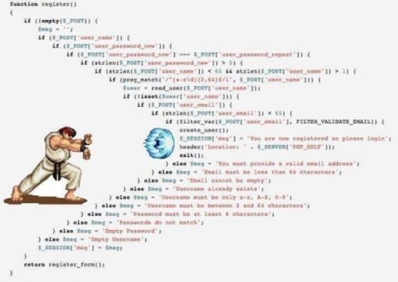

## 方法行数和清晰度

通常，行数越少，方法越清晰，可读性越高。当方法具有以下特征时，可以考虑重构：

+ 嵌套太多

  

+ 处理过多的逻辑，特别是不同的业务逻辑（不符合单一职责）

+ 阅读时需要滚动屏幕

+ Work being performed at multiple abstraction levels

+ 方法被多个抽象级别调用

下面是一组根据代码行数评判方法优劣的参考标准：

+ 少于11行：优
+ 11行至20行：良
+ 21行至50行：中
+ 超过50行：差

> :warning: 但代码行数不是评判方法优劣的唯一标准。命名、参数的多少、是否符合单一职责、是否利于单元测试等也应考虑在内。
>
> 我们不能为了减少代码行数而丧失方法的可读性，而是在保证可读性的前提下尽可能减少代码行数

## 高内聚

如果一个方法不符合单一职责，如处理过多的逻辑或不同类型的任务，它就很难保证一个较少的行数且不具有高内聚性。

对比下面两段代码，第一段中Process方法中处理了过多的逻辑细节，第二段代码对其进行重构后Process方法在结构和语义上变得更加清晰，并且提取出的两个方法`IsValidCustomer`和`SaveCustomer`可以在其它地方复用。

```c#
namespace CleanCSharp.Methods.Dirty
{
    class Utils
    {
        public int Process(Customer customer)
        {
            if (string.IsNullOrWhiteSpace(customer.FirstName) || string.IsNullOrWhiteSpace(customer.LastName))
            {
                return -1;
            }
            else
            {
                var service = new CustomerService();
                if (!service.Save(customer))
                {
                    return -1;
                }
                else
                {
                    return 1;
                }
            }
        }
    }
    
}
```

上面的代码中还出现了如1和-1这样的硬编码（魔法字符串），阅读者不知道他们代表什么含义，这种硬编码不应该出现。虽然上述代码行数不多，但它并不是一个好方法。

```c#
namespace CleanCSharp.Methods.Clean
{
    class Utils
    {
        public int Process(Customer customer)
        {
            const int customerNotSaved = -1; 
            const int customerSavedSuccessfully = 1;
            if (!IsValidCustomer(customer))
            {
                return customerNotSaved;
            }
            if (!SaveCustomer(customer))
            {
                return customerNotSaved;
            }
            return customerSavedSuccessfully;
        }
        
        private bool IsValidCustomer(Customer customer)
        {
            if (string.IsNullOrWhiteSpace(customer.FirstName) || string.IsNullOrWhiteSpace(customer.LastName))
            {
                return false;
            }
            return true;
        }
        
        private bool SaveCustomer(Customer customer)
        {
            var service = new CustomerService();
            var successfullySaved = service.Save(customer);
            return successfullySaved;
        }
    }
    
}
```

方法应该符合单一职责原则，这样方法会具备高内聚、利于单元测试、利于复用、较少行数、易于阅读和维护等优点。

## 抽象层级（Abstraction Levels）

按作者书中描述，抽象层级类似于我们平日所说高层模块、底层模块的概念。即，高层模块抽象层级高，底层模块抽象层级低。

作者在书中所要表述的意思可以归纳为一句话：**越高高层级的抽象层越不要暴露过多的细节**。

我们在阅读高抽象层级的代码时，应该像阅读业务流程说明书一样，不应在细节上耗费太多精力与时间。当我们需要了解细节时，在转到相关方法的定义去查看即可。如：

HTTP是应用层的一种网络通讯协议。这句话就是高层级的抽象层，至于HTTP的细节则属于底层级的抽象层。

仔细体会下下面重构前后两段代码的差异。重构前：

```c#
public class ProspectiveCustomerValidator
{
    public Customer CreateValidatedCustomer(ProspectiveCustomer prospectiveCustomer)
    {
        if (string.IsNullOrWhiteSpace(prospectiveCustomer.FirstName))
        {
            throw new ArgumentException("Invalid FirstName");
        }
        if (string.IsNullOrWhiteSpace(prospectiveCustomer.SecondName))
        {
            throw new ArgumentException("Invalid SecondName");
        }
        var newValidCustomer = new Customer
        {
            FirstName = prospectiveCustomer.FirstName,
            SecondName = prospectiveCustomer.SecondName
        };
        if (prospectiveCustomer.AnnualIncome > 100000)
        {
            newValidCustomer.IsPriorityCustomer = true;
        }
        return newValidCustomer;
    }
}
```

重构之后：

```c#
public class ProspectiveCustomerValidator
{
    // Higher abstraction level
    public Customer CreateValidatedCustomer(ProspectiveCustomer prospectiveCustomer)
    {
        EnsureValidDetails(prospectiveCustomer);
        var validatedCustomer = CreateNewCustomerFrom(prospectiveCustomer);
        SetCustomerPriority(validatedCustomer);
        return validatedCustomer;
    }
    
    // Medium abstraction level
    private static void EnsureValidDetails(ProspectiveCustomer prospectiveCustomer)
    {
        EnsureValidFirstName(prospectiveCustomer);
        EnsureValidSecondName(prospectiveCustomer);
    }
    
    private static Customer CreateNewCustomerFrom(ProspectiveCustomer prospectiveCustomer)
    {
        return new Customer { FirstName = prospectiveCustomer.FirstName, SecondName = prospectiveCustomer.SecondName, AnnualIncome = prospectiveCustomer.AnnualIncome };
    }
    
    // Low abstraction level
    private static void EnsureValidFirstName(ProspectiveCustomer prospectiveCustomer)
    {
        if (string.IsNullOrWhiteSpace(prospectiveCustomer.FirstName))
        {
            throw new ArgumentException("Invalid FirstName");
        }
    }
    
    private static void EnsureValidSecondName(ProspectiveCustomer prospectiveCustomer)
    {
        if (string.IsNullOrWhiteSpace(prospectiveCustomer.SecondName))
        {
            throw new ArgumentException("Invalid SecondName");
        }
    }
    
    private static void SetCustomerPriority(Customer customer)
    {
        if (customer.AnnualIncome > 100000)
        {
            customer.IsPriorityCustomer = true;
        }
    }
}
```

## 执行动作或给出答复

可以使用下面两个标准判断一个方法是否高内聚：

+ 是否执行了某些动作或实现了某些功能，或
+ 是否回答了调用者的问题；

如果一个方法同时具备上述两点，那么可以考虑对方法进行重构。

如方法`IsValidCustomer`就只是回答了调用方客户信息是否合法的问题：

```c#
private bool IsValidCustomer(Customer customer)
{
    if (string.IsNullOrWhiteSpace(customer.FirstName) || string.IsNullOrWhiteSpace(customer.LastName))
    {
        return false;
    }
    return true;
}
```

而方法`SaveCustomer`即执行了保存客户信息的操作，同时也告诉了调用方保存是否成功。

```c#
private bool SaveCustomer(Customer customer)
{
    var service = new CustomerService();
    var successfullySaved = service.Save(customer);
    return successfullySaved;
}
```

我们可以基于异常来对该方法进行重构：

```c#
private void SaveCustomer(Customer customer)
{
    var service = new CustomerService();
    try
    {
        service.Save(customer);
    }
    catch (Exception ex)
    {
        // 处理异常或抛给调用方
    }
}
```

这里好怀念JAVA中的throws关键字，可以让调用方明确感受到被调用的方法可能抛出哪些异常。

即执行某些操作又返回操作是否成功的形式，在ORM框架中使用比较多，它们通常返回一个整数类型表示本次方法调用数据库受影响行数。如EF中的SaveChanges、Dapper中的Execute等：

```c#
public virtual int SaveChanges()
{
    // ...
}

public static int Execute(this IDbConnection cnn, CommandDefinition command)
{
    // ...
}
```

其实，.NET基础类库中的TryParse方法也是这种形式：

```c#
public static bool TryParse(string s, out int result)
{
    // ...
}
```

个人感觉，即执行动作又返回结果这种形式可以接受。

## 方法参数

方法参数越多，越难以理解，也越难以维护。下面是一组根据代码行数评判方法优劣的参考标准：

+ 无参：优
+ 一个参数：良
+ 两个参数：中
+ 三个参数：较差
+ 多于三个参数：差

这只是一个参考标准，如【方法行数和清晰度】所述，方法优劣的评判不能只看一方面。

可以将方法中的多个参数封装成一个类以减少参数个数。

#### 根据布尔类型切换业务逻辑

对于方法接受布尔类型参数来执行不同业务逻辑的情况，建议对方法进行拆分。下面的例子中将方法`OutputGreeting`拆分为`OutputDaytimeGreeting`和`OutputMorningGreeting`：

```c#
namespace CleanCSharp.Methods.Dirty
{
    class BooleanSwitchingArgumentsExample
    {
        public void CallingCode()
        {
            if (DateTime.Now.Hour < 12)
            {
                OutputGreeting(true);
            }
            else
            {
                OutputGreeting(false);
            }
        }
        
        public void OutputGreeting(bool isMorning)
        {
            if (isMorning)
            {
                Console.WriteLine("Good Morning");
            }
            else
            {
                Console.WriteLine("Good Day");
            }
        }
        
    }
}
```

```c#
namespace CleanCSharp.Methods.Clean
{
    class BooleanSwitchingArgumentsExample
    {
        public void CallingCode()
        {
            if (DateTime.Now.Hour < 12)
            {
                OutputMorningGreeting();
            }
            else
            {
                OutputDaytimeGreeting();
            }
        }
        
        private static void OutputDaytimeGreeting()
        {
            Console.WriteLine("Good Day");
        }
        
        private static void OutputMorningGreeting()
        {
            Console.WriteLine("Good Morning");
        }
        
    }
}
```

`DateTime.Now.Hour < 12`这个判断条件与模板方法中的钩子函数作用相似。

#### 不同方法中具有相同逻辑

如若不同方法中含有相同的逻辑，应把相同的逻辑提取出来封装为一个公共方法。

## 小结

方法优劣的评判标准不是唯一的，但应符合**单一职责**原则，这样方法自然就是高内聚的，且利于单元测试、利于复用、易于阅读和维护。

方法行数不要太多，这不仅利于方法的阅读和维护。对于在只给程序员配置14寸笔记本的公司里编码的同行而言，这条应该也是相当重要的:sob: 。

公司架构师说，不去直接调用第三方依赖的方法，而是自己再封装一下，这样系统就不直接依赖第三方库了，第三方库的变动对于系统的影响也可以降到最低。有一定道理。

## 推荐阅读

[【译】单元测试最佳实践](https://www.jianshu.com/p/6f496aedd080)


