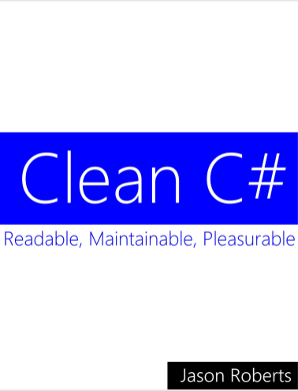
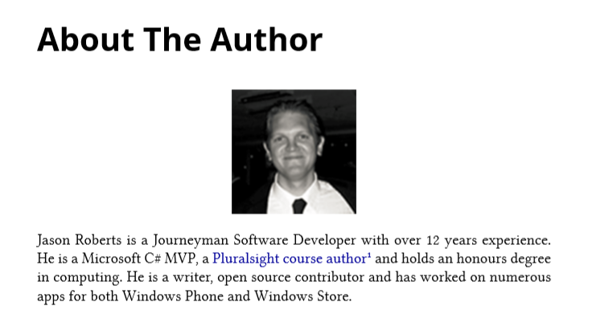

《Clean C#》的副标题是**Readable,Maintainable,Pleasurable**，本书旨在提供一些编写具有良好可读性与可维护性代码的建议。

虽然书名中带有C#字眼，但书中提供的经验绝不仅限于C#，也可用于其他语言。

该译文不是对原著进行一字一句的翻译，而是根据自己的理解，会加入一些对理解书中内容有帮助的东西，并且对书中的语言进行了重新编排以便更符合汉语表述习惯。在每个章节的结尾会加入一段总结，文末也可能会添加一些扩展阅读文章链接。

本书的翻译未经作者授权，仅作学习用途，转载务必保留原书及作者信息。原书封面及作者信息如下：

---

---

雪飞鸿 · 写于2018-10-22
